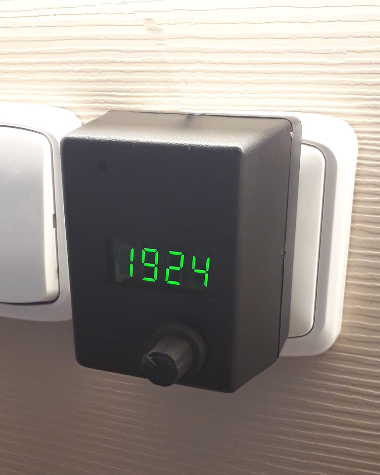
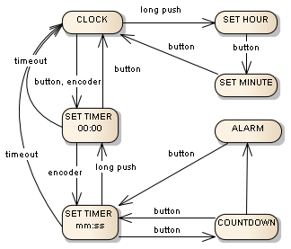
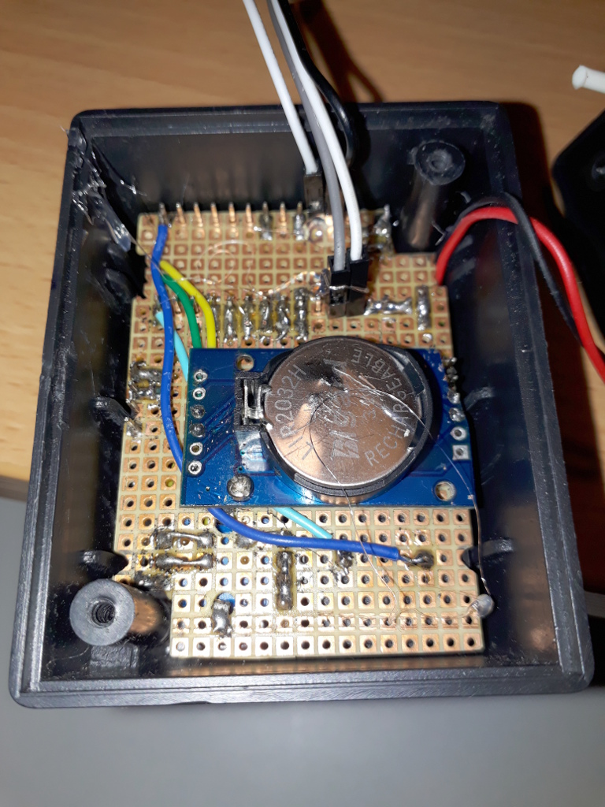
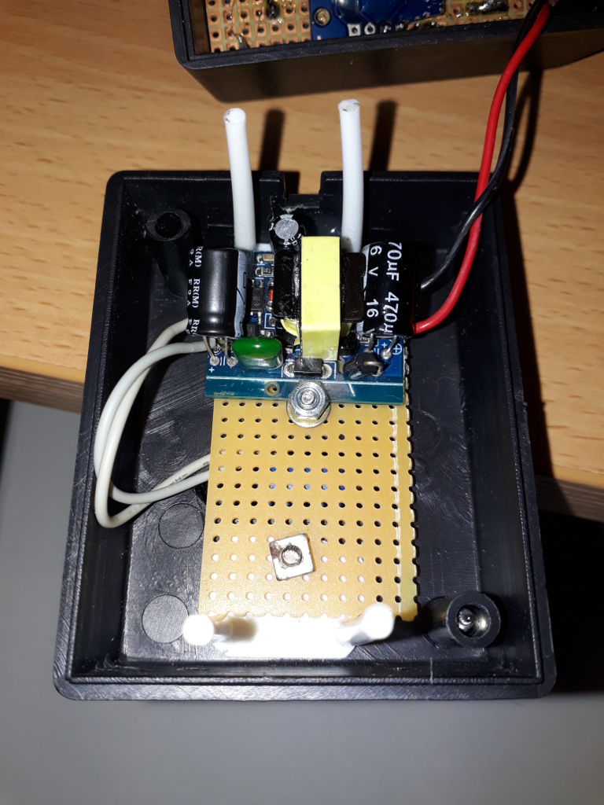
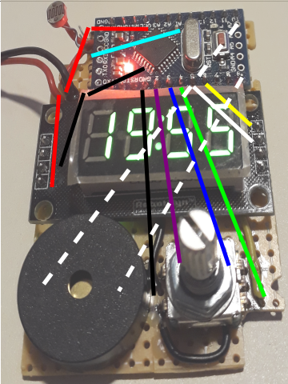
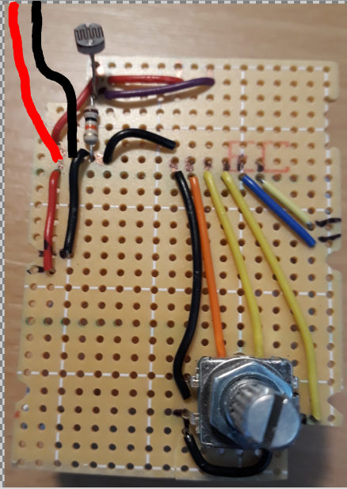

# KitchenTimerClock

A kitchen timer with clock. Uses Arduino Mini, encoder with button, TM1637 display, a piezo speaker, LDR and DS3231 RTC module. Everything soldered on a perfboard and put in an wall socket adapter box including a small AC/DC adapter. 

The request from my brother-in-law was a kitchen timer working the same way as the timer on a Whirlpool microwave oven.

## Images

RTC was added late to the design. On the photo of the back side with the RTC module you can see that it is soldered to Vcc and Gnd surpassing pins of the display module. The green and yellow wire on left are I2C to pins A4 and A5 of the Arduino.

On the photo of the back side there are still jumper wires to USB adapter on surpassing Arduino pins.

## User's manual

* The rotating knob is a push button too.
* In the clock mode pushing the knob or rotating it clockwise starts the timer's setting mode.
* Rotating the knob in timer setting mode sets the start time of the countdown.
* Pushing the knob with timer start time set, starts the timer countdown.
* Rotating the knob in countdown mode changes the running countdown time.
* When the timer countdown reaches zero the display starts to blink at full brightness and the bell rings tree times. 
* Pushing the knob ends the alarm end returns the timer to the last set start time.
* In alarm mode the bell rings tree times every minute.
* Pushing the knob at 0:00 switches back to the clock view.
* Timer set mode returns to clock view after a minute of no activity.
* Long push in timer setting mode resets the timer start time to 0:00.
* Long push in clock mode starts the clock time setting mode.
* Long push time is 3 seconds.
* All possible actions are shown in the states diagram.

